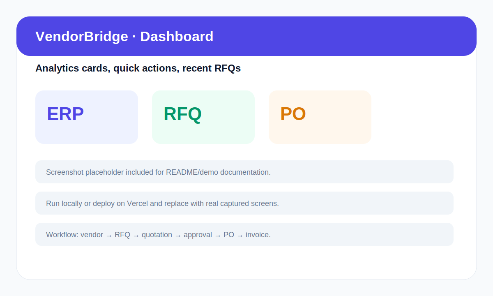
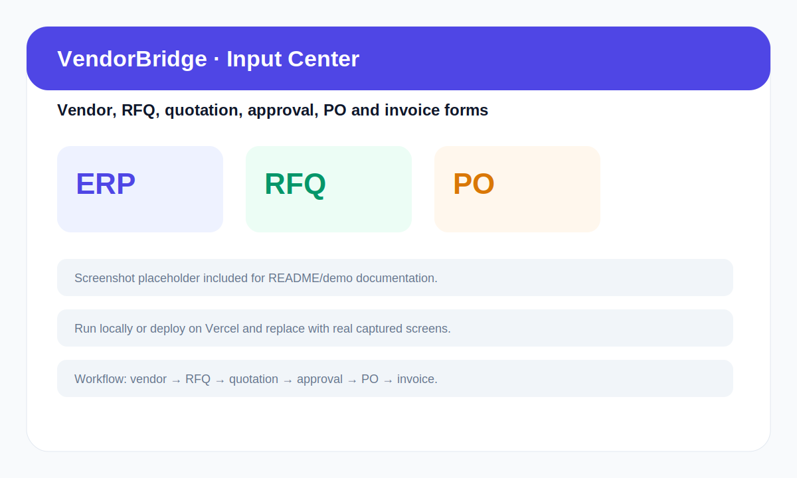
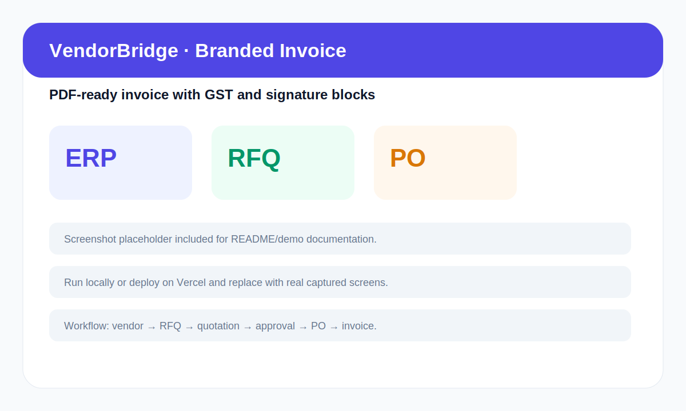

# VendorBridge — Procurement & Vendor Management ERP

VendorBridge is a hackathon-ready Procurement & Vendor Management ERP that digitizes the full workflow from vendor registration to RFQ creation, quotation comparison, approvals, purchase orders, invoice generation, branded PDF download, email-ready invoices, audit logs, and analytics.

## Live demo / links

- **Live Demo:** Add your Vercel URL here after deployment
- **GitHub:** Add your repository URL here
- **Demo Password:** `demo123`

## Demo credentials

| Role | Email | Password | What to demo |
|---|---|---|---|
| Admin | `admin@vendorbridge.com` | `demo123` | Full access, reports, settings |
| Procurement Officer | `officer@vendorbridge.com` | `demo123` | Vendors, RFQs, POs, invoices |
| Manager / Approver | `manager@vendorbridge.com` | `demo123` | Approval workflow and monitoring |
| Vendor | `vendor@vendorbridge.com` | `demo123` | RFQ tracking and quotation submission |

## Screenshots

> Replace these placeholder SVGs with real screenshots before final submission. They are included so the README already has a judge-friendly screenshots section.

| Landing | Dashboard |
|---|---|
|  |  |

| Input Center | Invoice |
|---|---|
|  |  |

## Problem fit

VendorBridge directly maps to the hackathon problem statement:

- Register and manage vendors
- Create RFQs with product/service details, deadlines and vendor assignment
- Receive vendor quotations
- Compare quotations with price, delivery and vendor rating signals
- Process manager approvals and rejections
- Generate purchase orders
- Generate invoices
- Download branded invoice PDF
- Prepare/send invoice emails through a mock safe demo flow
- Track procurement activities through audit logs and analytics
- Support role-based workflows for Admin, Procurement Officer, Vendor and Manager

## Important: demo data strategy

This project intentionally keeps realistic seeded demo data. Judges can immediately see a working ERP without spending 5 minutes creating records.

The app also supports real demo inputs through:

```text
/dashboard/input
```

Input Center supports:

- Vendor registration input
- RFQ creation input
- Vendor quotation input
- Approval/rejection input
- Purchase order generation input
- Invoice generation input
- Edit/delete for user-entered vendors
- Loading states and clear success/error messages
- Demo reset button
- Procurement timeline
- AI-style vendor recommendation explanation

User-entered demo records are saved in browser `localStorage`, while the seed data remains available for a polished evaluation demo.

## Tech stack

- Next.js App Router
- React + TypeScript
- CSS utility classes and responsive custom styles
- Sonner toast notifications
- Recharts for analytics
- jsPDF for branded invoice PDF generation
- Optional Anthropic API for AI RFQ generation / ProcureGPT
- Optional Supabase auth integration
- LocalStorage demo persistence for hackathon-safe input workflows

## Architecture

```text
app/
├── api/                    # Health, demo data, AI RFQ, invoice email mock
├── auth/                   # Login and signup
├── dashboard/              # ERP modules
│   ├── input/              # Real demo input workflow center
│   ├── vendors/            # Vendor management
│   ├── rfqs/               # RFQs and RFQ details
│   ├── quotations/         # Quotation comparison
│   ├── approvals/          # Manager approval workflow
│   ├── purchase-orders/    # PO generation and tracking
│   ├── invoices/           # Invoice tracking, email, PDF download
│   ├── reports/            # Analytics
│   └── audit/              # Audit trail
components/
├── ai/                     # ProcureGPT assistant
└── layout/                 # Sidebar/header with role navigation
lib/
├── seed-data.ts            # Realistic procurement demo data
├── demo-workflow.ts        # LocalStorage input persistence helpers
├── types.ts                # Shared ERP types
└── utils.ts                # Formatting helpers
database/
└── schema.sql              # Production-style relational ERP schema
```

## API endpoints

| Endpoint | Purpose |
|---|---|
| `GET /api/health` | Health check for deployment/demo |
| `GET /api/demo-data` | Returns demo users, vendors, RFQs, quotations, POs, invoices |
| `POST /api/rfq-generate` | AI/fallback RFQ generation |
| `POST /api/chat` | ProcureGPT assistant route |
| `POST /api/invoices/send` | Safe mock invoice email sending |

## Database schema

A production-oriented relational schema is included at:

```text
database/schema.sql
```

It models:

- Users and roles
- Vendors
- RFQs and RFQ items
- Vendor invitations
- Quotations and quotation items
- Approval workflow
- Purchase orders and PO items
- Invoices and tax calculations
- Audit logs

For hackathon demo mode, the app runs without database setup. For production, connect the schema to Supabase/PostgreSQL.

## Local setup

```bash
npm install
cp .env.example .env.local
npm run dev
```

Open:

```text
http://localhost:3000
```

## Environment variables

All integrations are optional for demo mode.

```bash
ANTHROPIC_API_KEY=your_anthropic_api_key
NEXT_PUBLIC_SUPABASE_URL=your_supabase_url
NEXT_PUBLIC_SUPABASE_ANON_KEY=your_supabase_anon_key
RESEND_API_KEY=your_resend_api_key
```

Without these keys, the app still runs with demo data and fallback AI/email responses.

## Build check

```bash
npm run lint
npx tsc --noEmit
npm run build
```

Latest local verification in this package:

- `npx tsc --noEmit` passed
- `npm run lint` had warnings only from pre-existing unused imports
- `npm run build` compiled successfully; the sandbox timed out during page-data collection, so run it locally for the final full build confirmation

## Recommended 2–3 minute demo flow

1. Start at landing page and explain the business problem.
2. Login as Procurement Officer using `officer@vendorbridge.com` / `demo123`.
3. Show Dashboard analytics and demo-mode banner.
4. Open Input Center and create a vendor.
5. Create an RFQ and assign vendors.
6. Login or switch to Vendor and submit a quotation.
7. Login as Manager and approve/reject with remarks.
8. Login as Procurement Officer and generate PO/invoice.
9. Download branded invoice PDF and open invoice email modal.
10. End with Reports and Audit Trail to show ERP-grade traceability.

## 1-minute pitch

VendorBridge is a procurement and vendor management ERP that replaces manual procurement work with a structured digital workflow. Organizations can manage vendors, create RFQs, receive and compare quotations, route approvals, generate purchase orders and invoices, download branded invoice PDFs, prepare invoice emails, and track every activity through analytics and audit logs. It reduces procurement delays, improves vendor decisions, and gives teams ERP-grade transparency without overcomplicated setup.

## Judge Q&A

**Q: Is this only static demo data?**  
No. The project includes realistic seed data so judges can understand the ERP quickly, and it also includes Input Center where users can add vendors, create RFQs, submit quotations, approve/reject, generate POs and generate invoices. Input records persist in browser localStorage during the demo.

**Q: Why use demo mode instead of a live database?**  
For hackathon reliability. The database schema is included for production, while demo mode ensures the evaluator can run the app without external setup.

**Q: How are roles handled?**  
The UI has role-based navigation and action restrictions. Vendors cannot create RFQs, managers focus on approvals, procurement officers handle RFQs/POs/invoices, and admins have broad access.

**Q: What makes this ERP-grade?**  
It has module separation, typed data models, workflow state transitions, GST-aware invoice handling, audit logs, reports, and a relational schema.

## Future improvements

- Connect Supabase/PostgreSQL as the live database
- Add real vendor portal links using magic tokens
- Enable real email sending with Resend
- Add RFQ and quotation attachments
- Add multi-level approval rules based on amount thresholds
- Add exportable PDF analytics reports
- Add richer dark mode and notification preferences
